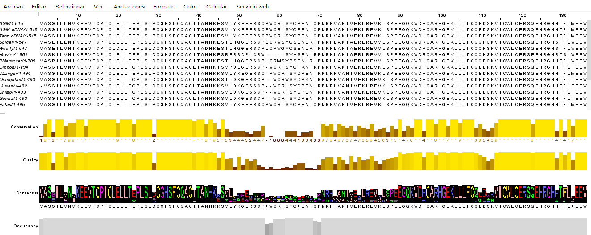
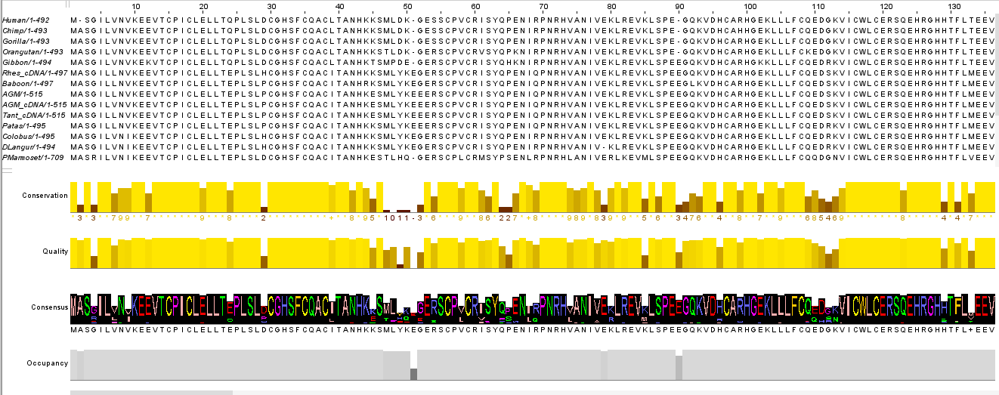
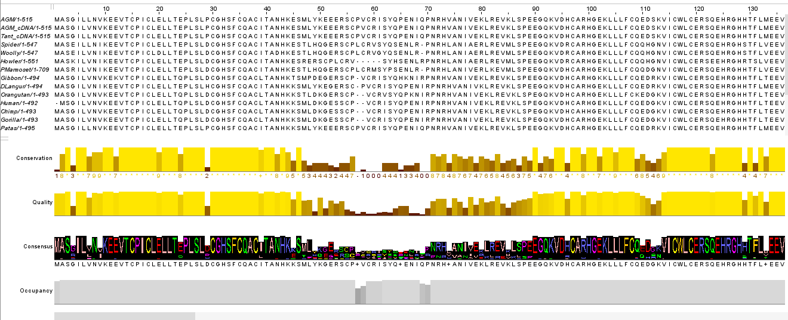

Complete los pasos que se indican en el taller al final de la guía. Una vez los complete reporte en este documento los comandos y resultados obtenidos. Puede hacer uso de los bloques de código para mostrar los comandos y las salidas de los mismos.

### 1. Corriendo diferentes alineadores múltiples. \[1.5 puntos\]

-   Realice el alineamiento de ClustalOmega. Guarde el alineamiento y, seleccione FastA o ClustalW como formato de salida, asegúrese de cambiar el nombre del archivo de salida para evitar sobrescribir el archivo original.

Se utiliza ClustalW para descargar el archivo.

-   Ahora, realice el alineamiento con T-Coffee. Cuando el procedimiento de alineamiento haya terminado será direccionado a una nueva página con enlaces a los archivos de salida. Guarde el alineamiento en formato Fasta o ClustalW en su computador.

-   Finalmente, realice el alineamiento en MUSCLE. Cargue su archivo de secuencias usando la opción Upload a file. Asegúrese que la salida esté en formato FastA o ClustalW.

### 2. Comparando alineamientos múltiples. \[1.5 puntos\]

-   Usando JalView para comparar los resultados obtenidos en la parte A de ClustalOmega, T-Coffee y MUSCLE, mencione dónde comienzan y acaban las primeras tres regiones conservadas para cada algoritmo; indique las posiciones y qué tan largos son. Asuma que las regiones conservadas son de mínimo 10 aminoácidos de longitud.

Las regiones se derminaron de forma visual, teniendo en consideración únicamente las regiones que tienen del 95% al 100% de conservación.

ClustalOmega

|   | Región Conservada 1 | Región Conservada 2 | Región Conservada 3 |
|----|----|----|----|
| Largo de la región conservada | 18 | 14 | 21 |
| Inicio región conservada | 10 | 30 | 88 |
| Fin región conservada | 28 | 44 | 109 |

T-Coffe

|   | Región Conservada 1 | Región Conservada 2 | Región Conservada 3 |
|----|----|----|----|
| Largo de la región conservada | 18 | 14 | 19 |
| Inicio región conservada | 10 | 30 | 86 |
| Fin región conservada | 28 | 44 | 109 |

MUSCLE

|   | Región Conservada 1 | Región Conservada 2 | Región Conservada 3 |
|----|----|----|----|
| Largo de la región conservada | 18 | 14 | 19 |
| Inicio región conservada | 10 | 30 | 86 |
| Fin región conservada | 28 | 44 | 109 |

-   ¿Qué modificaciones se podrían hacer a los alineamientos? ¿Hay alguna(s) secuencia(s) que se podría(n) eliminar?

Se deberia eliminar el tramo de 340 a 554, ya que en este tramo las mayoría de las secuencias no contiene información, por lo tanto no aporta al análisis.

-   ¿Qué métodos de alineamientos presentan las mayores diferencias entre sí? ¿Qué métodos presentan las menores? Explique basado en la metodología de cada algoritmo sus resultados.

ClustalOmega y T-Coffee presentan mayores diferencias entre sí, dado que se logra observar que T-Coffee logra encontrar regiones conservadas que ClustalOmega no (Korak, et.al, 2021).

Por otro lado, hay menores diferencias entre Muscle y T-Coffee ya que ambos manejan muy buena precisión, debido a su alta sensibilidad (Korak, et.al, 2021).

En los resultados obtenidos se observa que en términos generales los 3 métodos encuentran las mismas regiones conservadas, con ligeras variaciones en el principio o final del tramo. Posiblemente esto se debe a que se están analizando pocas secuencias que manejan una alta similitud entre sí, lo cual ha generado que los 3 métodos llegan prácticamente a los mismos resultados.

### 3. Perfiles de HMMs y homologías. \[1.25 puntos\]

### 4. Analizando dominios y familias de proteínas \[0.75 puntos\]

### 5. Referencias

Korak, T., Aşır, F., Işik, E., & Cengiz, N. (2021). *Multiple sequence alignment quality comparison in T-Coffee, MUSCLE and M-Coffee based on different benchmarks*. **Cumhuriyet Science Journal, 42**(3), 526–535. https://doi.org/10.17776/csj.842265
