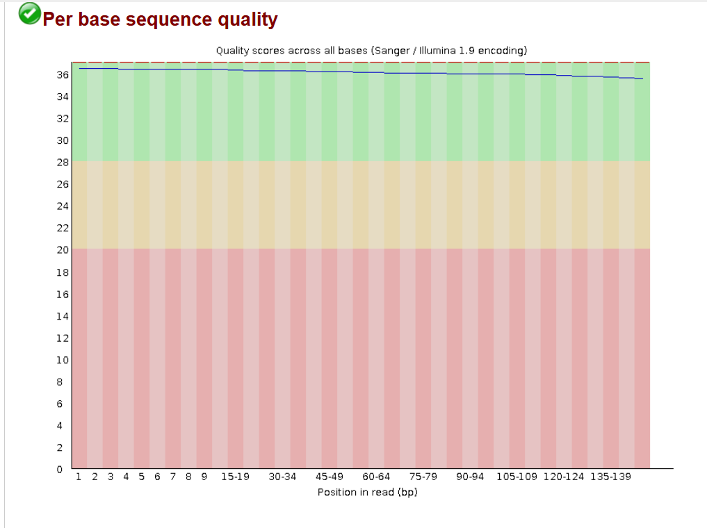
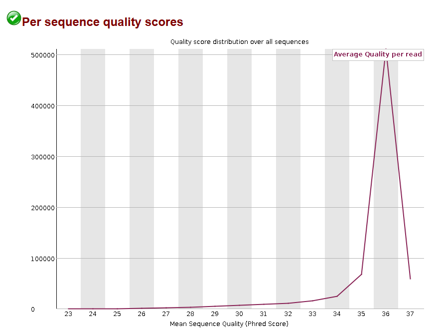
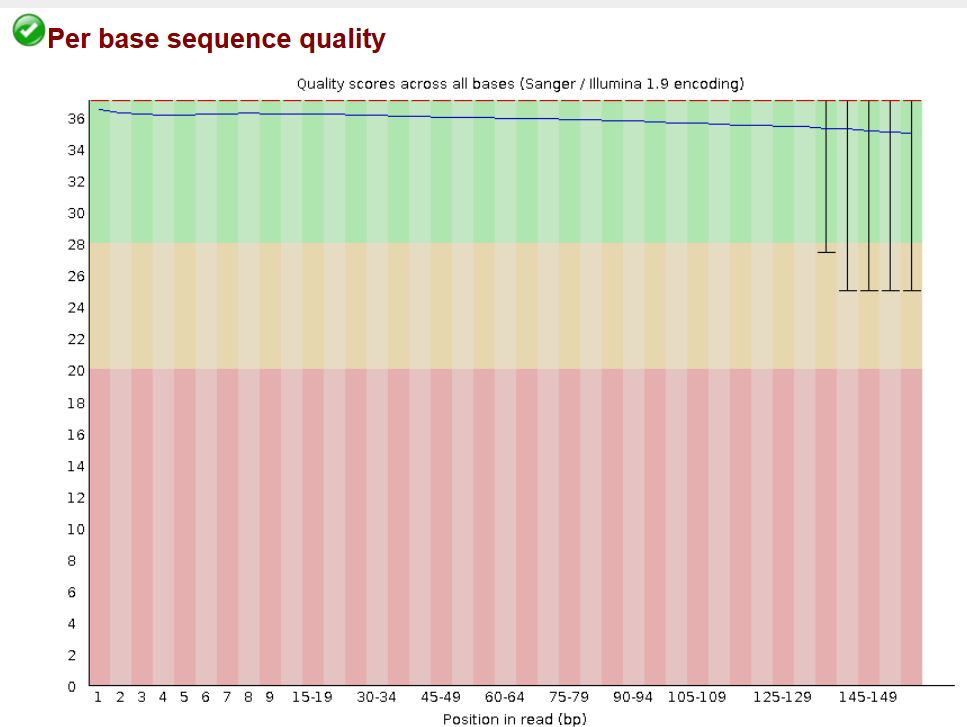
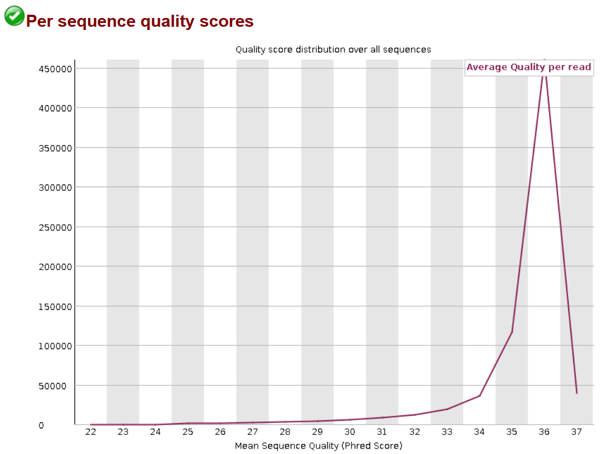
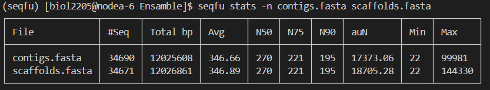

Complete los pasos que se indican en el taller al final de la guía. Una vez los complete reporte en este documento los comandos y resultados obtenidos. Puede hacer uso de los bloques de código para mostrar los comandos y las salidas de los mismos.

### 1. Revisando calidad de lecturas \[1.5 puntos\]

**Secuencia bsubtiliscc_trimmed_subs_1.fastq.gz**

Se observa que en general la calidad de la secuencia es muy buena, ya que la peor calidad registrada es hacia el final de la secuencia, y alcanza un valor de alrededor 34 de 40 en puntaje, siendo el mejor puntaje para esta cadena en las primeras bases con un valor de 36. Esto indica que la calidad de la secuenia tiene una tendencia relativamente constante, por lo cual no se requiere ningún recorte o corrección.

En esta gráfica se puede apreciar que la mayoría de secuencias tienen un puntaje de calidad de 36 (puntaje promedio), este es un buen valor de calidad. También se observa que el valor mínimo de calidad obtenido fue aproximadamente 28, lo cual indica que hubo muy pocas secuencias con mala calidad.

**Secuencia bsubtiliscc_trimmed_subs_2.fastq.gz**

La calidad promedio de esta secuencia es similar a la secuencia anterior, pues su máximo es 36 y su mínimo 34. No obstante, se observa que, a partir de los pares de bases 125-129 se grafican 5 barras negras que indican variabilidad en la calidad de las bases, es decir que este es un indicador de la desviación estándar de la calidad en estas bases.

Aunque esta variabilidad es bastante amplia, pues oscila dentro de un nivel de calidad muy bueno y un nivel de calidad medio, no se considera que se deba realizar ninguna corrección ni filtración.

### 2. Ensamble de genomas \[1.5 puntos\]

**Comando Ensamble de genomas**

-   spades.py -t 8 --isolate -k 21 -1 bsubtiliscc_trimmed_1.fastq.gz -2 bsubtiliscc_trimmed_2.fastq.gz -o Ensamble

### 3. Calidad de genomas \[1.25 puntos\]

**Resultados de la Calidad del Ensamble entre bsubtiliscc_trimmed_1.fastq.gz y subtiliscc_trimmed_2.fastq.gz**

**Analice las estadísticas obtenidas y describa la calidad del ensamble en términos de la longitud de los contigs y su N50.**

### 4. Visualizar y anotar el ensamble \[0.75 puntos\]
